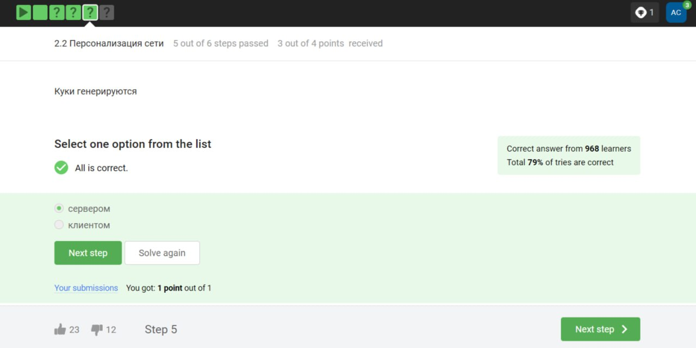
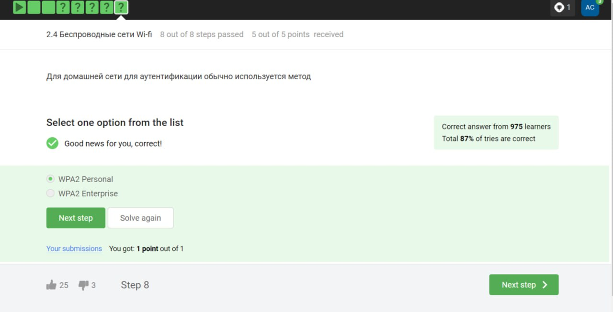

# Цель работы

Узнать, как обеспечивается безопасность интернет-трафика, какие пароли нужно выбирать и как их хранить, познакомиться с методами защиты сообщений в мессенджерах (WhatsApp, Telegram), понять, как работают механизмы аутентификации в электронных платежах, а также зачем нас иногда просят выбрать квадраты, где изображены светофоры.

# 2.1 Как работает интернет: базовые сетевые протоколы

Выберите протокол прикладного уровня. (рис. [-@fig:001]).

{#fig:001 width=70%}

На каком уровне работает протокол TCP? (рис. [-@fig:002]).

{#fig:002 width=70%}

Выберите все корректные адреса IPv4. (рис. [-@fig:003]).

{#fig:003 width=70%}

DNS сервер. (рис. [-@fig:004]).

{#fig:004 width=70%}

Выберите корректную последовательность протоколов в модели TCP/IP. (рис. [-@fig:005]).

{#fig:005 width=70%}

Протокол http предполагает (рис. [-@fig:006]).

{#fig:006 width=70%}

Протокол http состоит из (рис. [-@fig:007]).

{#fig:007 width=70%}

Версия протокола TLS определяется  (рис. [-@fig:008]).

{#fig:008 width=70%}

В фазе "рукопожатия" протокола TLS не предусмотрено  (рис. [-@fig:009]).

{#fig:009 width=70%}

# 2.2 Персонализация сети

Куки хранят:  (рис. [-@fig:010]).

{#fig:010 width=70%}

Куки не используются для. (рис. [-@fig:011]).

{#fig:011 width=70%}

Куки генерируются (рис. [-@fig:012]).

{#fig:012 width=70%}

Сессионные куки хранятся в браузере?  (рис. [-@fig:013]).

{#fig:013 width=70%}

# 2.3 Браузер TOR. Анонимизация 

Сколько промежуточных узлов в луковой сети TOR?  (рис. [-@fig:014]).

{#fig:014 width=70%}

IP-адрес получателя известен (рис. [-@fig:015]).

{#fig:015 width=70%}

Отправитель генерирует общий секретный ключ (рис. [-@fig:016]).

{#fig:016 width=70%}

Должен ли получатель использовать браузер Tor (или другой браузер, основанный на луковой маршрутизации) для успешного получения пакетов? (рис. [-@fig:017]).

{#fig:017 width=70%}

# 2.4 Беспроводные сети Wi-fi

Wi-Fi - это (рис. [-@fig:018]).

{#fig:018 width=70%}

На каком уровне работает протокол WiFi? (рис. [-@fig:019]).

{#fig:019 width=70%}

Небезопасный метод обеспечения шифрования и аутентификации в сети Wi-Fi (рис. [-@fig:020]).

{#fig:020 width=70%}

Данные между хостом сети (компьютером или смартфоном) и роутером (рис. [-@fig:021]).

{#fig:021 width=70%}

Для домашней сети для аутентификации обычно используется метод (рис. [-@fig:022]).

{#fig:022 width=70%}

# 3.1 Шифрование диска

Можно ли зашифровать загрузочный сектор диска. (рис. [-@fig:023]).

{#fig:023 width=70%}

Шифрование диска основано на (рис. [-@fig:024]).

{#fig:024 width=70%}

С помощью каких программ можно зашифровать жесткий диск? (рис. [-@fig:025]).

{#fig:025 width=70%}

# 3.2 Пароли

Какие пароли можно отнести с стойким? (рис. [-@fig:026]).

{#fig:026 width=70%}

Где безопасно хранить пароли? (рис. [-@fig:027]).

{#fig:027 width=70%}

Зачем нужна капча? (рис. [-@fig:028]).

{#fig:028 width=70%}

Для чего применяется хэширование паролей? (рис. [-@fig:029]).

{#fig:029 width=70%}

Поможет ли соль для улучшения стойкости паролей к атаке перебором, если злоумышленник получил доступ к серверу? (рис. [-@fig:030]).

{#fig:030 width=70%}

Какие меры защищают от утечек данных атакой перебором?  (рис. [-@fig:031]).

{#fig:031 width=70%}

# 3.3 Фишинг

Какие из следующих ссылок являются фишинговыми? (рис. [-@fig:032]).

{#fig:032 width=70%}

Может ли фишинговый имейл прийти от знакомого адреса? (рис. [-@fig:033]).

{#fig:033 width=70%}

# 3.4 Вирусы. Примеры

Email Спуфинг -- это (рис. [-@fig:034]).

{#fig:034 width=70%}

Вирус-троян (рис. [-@fig:035]).

{#fig:035 width=70%}

# 3.5 Безопасность мессенджеров

На каком этапе формируется ключ шифрования в протоколе мессенджеров Signal? (рис. [-@fig:036]).

{#fig:036 width=70%}

Суть сквозного шифрования состоит в том, что (рис. [-@fig:037]).

{#fig:037 width=70%}

# 4.1 Введение в криптографию

В асимметричных криптографических примитивах. (рис. [-@fig:038]).

{#fig:038 width=70%}

Криптографическая хэш-функция (рис. [-@fig:039]).

{#fig:039 width=70%}

К алгоритмам цифровой подписи относятся (рис. [-@fig:040]).

{#fig:040 width=70%}

Код аутентификации сообщения относится к. (рис. [-@fig:041]).

{#fig:041 width=70%}

Обмен ключам Диффи-Хэллмана - это (рис. [-@fig:042]).

{#fig:042 width=70%}

# 4.2 Цифровая подпись

Протокол электронной цифровой подписи относится к (рис. [-@fig:043]).

{#fig:043 width=70%}

Алгоритм верификации электронной цифровой подписи требует на вход (рис. [-@fig:044]).

{#fig:044 width=70%}

Электронная цифровая подпись не обеспечивает (рис. [-@fig:045]).

{#fig:045 width=70%}

Какой тип сертификата электронной подписи понадобится для отправки налоговой отчетности в ФНС? (рис. [-@fig:046]).

{#fig:046 width=70%}

В какой организации вы можете получить квалифицированный сертификат ключа проверки электронной подписи?  (рис. [-@fig:047]).

{#fig:047 width=70%}

# 4.3 Электронные платежи

Выберите из списка все платежные системы. (рис. [-@fig:048]).

{#fig:048 width=70%}

Примером многофакторной аутентификации является (рис. [-@fig:049]).

{#fig:049 width=70%}

При онлайн платежах сегодня используется (рис. [-@fig:050]).

{#fig:050 width=70%}

# 4.4 Блокчейн

Какое свойство криптографической хэш-функции используется в доказательстве работы?  (рис. [-@fig:051]).

{#fig:051 width=70%}

Консенсус в некоторых системах блокчейн обладает свойствами (рис. [-@fig:052]).

{#fig:052 width=70%}

Секретные ключи какого криптографического примитива хранят участники блокчейна? (рис. [-@fig:053]).

{#fig:053 width=70%}

# Выводы

Мы изучили курс "Основы кибербезопасности".
